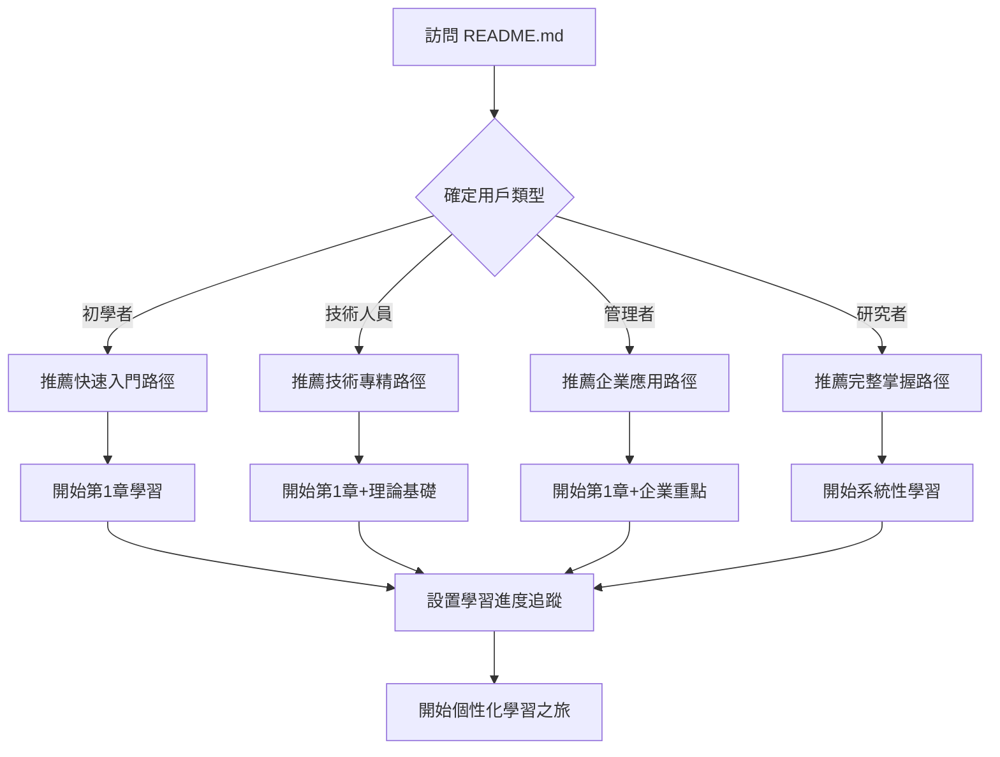

# 用戶體驗流程設計

書籍式導航系統的完整用戶體驗設計方案

---

## 🎯 設計理念

### 核心原則
- **直覺性**：用戶無需學習即可快速上手導航系統
- **一致性**：所有頁面提供統一的導航體驗
- **個性化**：支援不同用戶類型的個性化學習路徑
- **效率性**：最少點擊次數到達目標內容
- **進度可視**：清楚顯示學習進度和成就感

### 用戶類型分析
- **🌱 初學者**：需要引導和基礎概念建立
- **🎯 技術人員**：關注深度內容和實現細節
- **🏢 管理者**：重視商業價值和實施方案
- **📚 研究者**：需要完整理論體系和前沿動態

---

## 🚀 用戶首次體驗流程

### 入門引導流程


### 🌱 初學者首次體驗

#### 第一步：歡迎和路徑選擇
**页面**：README.md
**體驗**：
```
👋 歡迎來到提示工程精通指南！

🎯 快速測試：您的AI經驗水平？
[ ] 完全新手，想要快速入門
[ ] 有基礎經驗，希望系統學習  
[ ] 技術背景，要深度掌握
[ ] 管理層面，關注商業應用

✅ 推薦：基於您的選擇，建議從「快速入門路徑」開始
📊 預估時間：5-7天，每天1-2小時
🎁 即時收益：學完第1章即可立即提升AI對話效果300%
```

#### 第二步：學習目標設定
**頁面**：學習進度追蹤系統.md
**體驗**：
```
🎯 設定您的學習目標

學習目的：
[ ] 提升日常工作效率
[ ] 掌握AI工具使用技巧
[ ] 為團隊培訓做準備
[ ] 了解前沿技術發展

可用時間：
[ ] 每天30分鐘
[ ] 每天1小時
[ ] 週末集中學習
[ ] 其他自定義

✅ 自動生成個人化學習計劃
```

#### 第三步：開始學習體驗
**頁面**：快速入門指南.md
**體驗亮點**：
- 30秒內理解核心概念
- 5分鐘實踐看到效果
- 30分鐘掌握立即可用技巧
- 內建進度指示器和鼓勵機制

### 🎯 技術人員首次體驗

#### 深度學習流程
```
技術背景確認 → 理論基礎建立 → 核心技術掌握 → 
進階技術探索 → 前沿研究了解 → 創新應用實踐
```

**特色體驗**：
- 技術原理的深度解析
- 跨章節概念關聯圖
- 從基礎到前沿的完整技術棧
- 實踐項目和技術挑戰

### 🏢 管理者首次體驗

#### 商業價值導向流程
```
商業需求分析 → 快速概念理解 → 企業案例學習 → 
ROI評估方法 → 實施策略制定 → 團隊培訓計劃
```

**特色體驗**：
- 商業價值和ROI重點突出
- 企業實戰案例優先
- 團隊培訓和實施指南
- 高層決策支援資料

---

## 📱 多設備適配體驗

### 桌面端體驗（完整功能）
```
[導航欄] [主內容區域] [側邊目錄] [進度追蹤]
    │         │           │         │
    │         │           │         └─ 章節完成狀態
    │         │           └─────────── 可展開目錄樹
    │         └─────────────────────── 豐富的內容展示
    └───────────────────────────────── 完整導航控制
```

**特色功能**：
- 雙欄佈局，主內容+側邊導航
- 懸停顯示章節預覽
- 快捷鍵支援（J/K翻頁，/搜索）
- 閱讀進度視覺化

### 平板端體驗（適配體驗）
```
[折疊導航] [主內容區域] [底部控制]
      │           │           │
      │           │           └─ 上一章/下一章
      │           └─────────────── 適配的內容寬度
      └─────────────────────────── 手勢呼出導航
```

**適配重點**：
- 觸控友善的導航元素
- 滑動手勢支援
- 折疊式目錄結構
- 適配的閱讀字體大小

### 手機端體驗（核心功能）
```
[簡化標題]
[主要內容]
[進度指示]
[導航控制]
```

**簡化策略**：
- 保留核心導航功能
- 簡化進度顯示
- 大按鈕設計
- 垂直滾動優化

---

## 🎨 互動設計細節

### 導航互動模式

#### 1. 章節切換動畫
```css
/* 平滑過渡效果 */
.chapter-transition {
    animation: slideIn 0.3s ease-in-out;
}

/* 進度條更新動畫 */
.progress-update {
    animation: progressGrow 0.5s ease-out;
}
```

#### 2. 進度視覺化
```
學習進度：[████████████████████████████████████] 65% (12/18章)

本週學習：[████████░░] 3章完成
目標達成：[██████████] 100% 按計劃進行
```

#### 3. 成就系統
```
🏆 已獲得成就：
✅ 快速入門者：完成前3章學習
✅ 理論大師：完成第一部分所有章節
🔄 進行中：平台專家（進度：60%）
```

### 個性化體驗元素

#### 學習路徑個性化
- **自適應推薦**：基於閱讀歷史推薦下一章節
- **個人筆記**：每章節支援個人筆記和標籤
- **書籤功能**：重要內容快速收藏
- **學習統計**：個人學習數據分析

#### 內容個性化
- **難度調整**：根據用戶背景調整內容深度
- **範例選擇**：根據行業背景提供相關範例
- **語言偏好**：技術術語或通俗解釋切換
- **學習節奏**：快速瀏覽或深度學習模式

---

## 🔄 用戶行為分析與優化

### 關鍵用戶行為指標

#### 參與度指標
- **頁面停留時間**：評估內容吸引力
- **章節完成率**：評估內容難度適中性
- **返回率**：評估內容實用性
- **分享率**：評估內容價值認知

#### 學習效果指標
- **學習路徑完成率**：不同路徑的成功率
- **知識點掌握度**：通過自測評估
- **實際應用率**：學習後的實踐應用
- **推薦意願**：淨推薦值(NPS)

### 用戶反饋收集機制

#### 即時反饋系統
```markdown
## 📝 本章對您有幫助嗎？

😍 非常有幫助 😊 有幫助 😐 一般 😕 幫助不大 😞 沒有幫助

💬 快速反饋：
[ ] 內容太簡單  [ ] 內容太複雜  [ ] 範例不夠
[ ] 需要更多實踐  [ ] 理論不夠深入  [ ] 其他：_____
```

#### 詳細體驗調查
- **學習路徑評估**：路徑設計是否合理
- **導航體驗評估**：導航是否直觀易用
- **內容品質評估**：內容是否準確實用
- **整體滿意度**：綜合使用體驗評分

---

## 🛠️ 技術實現考量

### 響應式設計原則
```css
/* 移動優先設計 */
@media (min-width: 768px) {
    /* 平板樣式 */
}

@media (min-width: 1024px) {
    /* 桌面樣式 */
}
```

### 性能優化策略
- **懶加載**：大型內容分段載入
- **快取策略**：常用內容本地快取
- **圖片優化**：響應式圖片和WebP格式
- **字體優化**：Web字體載入優化

### 無障礙設計
- **語義化HTML**：正確的標題層級和語義標籤
- **鍵盤導航**：完整的鍵盤操作支援
- **螢幕閱讀器**：ARIA標籤和描述
- **對比度**：符合WCAG標準的顏色對比

---

## 📊 用戶體驗測試計劃

### A/B測試方案

#### 導航模式測試
- **方案A**：固定側邊導航
- **方案B**：浮動導航選單
- **測試指標**：導航使用率、用戶滿意度

#### 學習路徑測試
- **方案A**：線性推薦路徑
- **方案B**：個性化智能推薦
- **測試指標**：完成率、學習效果

#### 進度顯示測試
- **方案A**：詳細進度條
- **方案B**：簡化進度指示
- **測試指標**：用戶激勵效果、完成率

### 可用性測試
1. **任務完成測試**：新用戶首次使用完成特定學習任務
2. **導航效率測試**：用戶查找特定內容的時間和成功率
3. **學習路徑測試**：不同背景用戶的學習路徑適配度
4. **多設備體驗測試**：跨設備使用的一致性體驗

---

## 🚀 體驗優化持續改進

### 數據驅動優化
- **用戶行為分析**：熱力圖、點擊路徑分析
- **性能監控**：頁面載入時間、互動響應時間
- **錯誤追蹤**：404錯誤、連結失效監控
- **轉化分析**：從訪問到完成學習的轉化漏斗

### 迭代優化計劃
- **第一階段**：基礎導航體驗建立
- **第二階段**：個性化功能完善
- **第三階段**：智能推薦系統
- **第四階段**：社交學習功能

### 用戶社群建設
- **學習小組**：相同路徑用戶組成學習群組
- **經驗分享**：用戶學習心得和實踐案例分享
- **問答互助**：用戶間相互解答疑問
- **專家指導**：定期專家答疑和指導

---

## 📈 成功指標定義

### 用戶滿意度指標
- **整體滿意度**：≥ 4.5/5.0
- **推薦意願**：NPS ≥ 70
- **導航易用性**：易用性評分 ≥ 4.0/5.0

### 學習效果指標
- **路徑完成率**：≥ 80%
- **知識掌握度**：自測平均分 ≥ 85%
- **實際應用率**：≥ 70%的用戶學後實踐

### 技術性能指標
- **頁面載入時間**：< 2秒
- **互動響應時間**：< 100ms
- **錯誤率**：< 0.1%

---

**這套用戶體驗設計將確保每個用戶都能獲得個性化、高效率的學習體驗，從而最大化學習效果和用戶滿意度。**