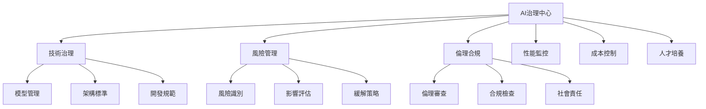

# 第5章：OpenAI GPT系列完整應用指南

> **AI產業領導平台的專業實戰指南** - 從技術架構到企業部署的完整攻略

## 📖 章節導覽

本章提供OpenAI GPT系列的完整應用指南，專注於實用技術指導，幫助您掌握當前最具影響力的AI平台。

### 🎯 學習目標
完成本章學習後，您將能夠：
- 深度掌握GPT-4系列模型的技術特性和選擇策略
- 熟練運用Function Calling進行企業系統整合
- 設計高效的提示工程架構和品質控制體系
- 建立可擴展的企業級GPT應用系統

### 📊 內容結構

| 學習層次 | 目標讀者 | 閱讀時間 | 核心內容 |
|---------|---------|----------|----------|
| **🚀 技術認知層** | 決策者、產品經理 | 8分鐘 | 平台定位、模型選擇 |
| **💼 應用實戰層** | 開發者、架構師 | 20分鐘 | 核心功能、系統整合 |
| **🔬 專家參考層** | 技術專家、團隊領導 | 35分鐘+ | 企業部署、治理框架 |

---

## 🚀 第一層：GPT平台技術認知（8分鐘掌握核心）

### 💎 OpenAI平台戰略定位

**2025年AI產業領導地位分析**

| 技術優勢 | 核心能力 | 企業價值 | 市場地位 |
|---------|----------|----------|----------|
| **模型技術領先** | GPT-4o、o3系列的突破性能力 | 處理複雜任務的可靠保證 | 全球使用量第一 |
| **生態系統完整** | API、插件、應用的全鏈整合 | 降低開發成本和技術門檻 | 開發者首選平台 |
| **企業級穩定性** | 99.9%可用性、全球CDN | 關鍵業務系統的可靠支撐 | 大型企業標準選擇 |
| **持續創新能力** | 快速迭代、功能持續升級 | 保持技術競爭優勢 | 引領產業發展方向 |

### ⚡ 2025年GPT模型系列技術解析

#### **GPT-4o：均衡型企業首選**

**技術規格與性能指標**
- **多模態能力**：文字、圖像、音頻統一處理架構
- **上下文窗口**：128K token，支援長篇文檔分析
- **響應速度**：平均2-3秒，適合實時應用
- **成本效益**：相比GPT-4降低50%，大幅降低企業使用成本

**最佳應用場景**
- **日常辦公自動化**：郵件處理、文檔分析、會議摘要
- **客戶服務系統**：智能客服、多語言支援、情感分析
- **內容創作輔助**：文案撰寫、創意發想、多媒體內容生成

#### **o3系列：推理專精模型**

**革命性推理能力**
- **Chain-of-Thought原生整合**：內建多步驟推理機制
- **複雜問題分解**：自動將困難任務分解為可解決的子問題
- **準確性突破**：在數學、科學、編程任務上達到專家級表現

**企業級應用價值**
- **戰略分析與決策**：複雜商業問題的深度分析
- **研發與創新支援**：科學計算、技術方案評估
- **專業服務增強**：法律、醫療、金融等專業領域應用

### 🎯 模型選擇決策框架

**基於業務需求的智能選擇**

| 使用場景 | 推薦模型 | 選擇理由 | 成本考量 |
|---------|----------|----------|----------|
| **高頻互動應用** | GPT-4o | 速度快、成本低、功能均衡 | $$ |
| **複雜分析任務** | o3-pro | 推理深度、準確性高 | $$$$ |
| **創意內容生成** | GPT-4o | 創意表現佳、響應快速 | $$ |
| **專業決策支援** | o3-pro | 邏輯嚴謹、可靠性高 | $$$$ |
| **批量處理任務** | GPT-4o-mini | 成本最優、處理高效 | $ |

**成本最佳化策略**
1. **任務分層處理**：簡單任務用mini版本，複雜任務用pro版本
2. **智能路由系統**：根據查詢複雜度自動選擇合適模型
3. **批量處理優化**：合併相似請求降低API調用成本
4. **快取機制**：常見查詢結果快取，避免重複處理

---

## 💼 第二層：企業應用實戰（20分鐘精通核心功能）

### 🛠️ Function Calling企業級整合

#### 2025年Function Calling技術升級

**革命性功能增強**
- **並行函數調用**：同時執行多個API操作，效率提升300%
- **智能參數推理**：自動推斷函數參數，減少手動配置
- **錯誤自癒機制**：失敗自動重試和降級處理
- **上下文感知路由**：根據對話歷史智能選擇功能組合

#### 企業系統整合架構設計

**CRM系統智能化改造案例**

```javascript
// 企業級CRM整合架構
const crmIntegration = {
  // 客戶服務全流程自動化
  customerServiceFlow: [
    {
      step: "客戶識別",
      function: "getCustomerProfile",
      description: "根據聯繫信息獲取客戶完整檔案"
    },
    {
      step: "歷史查詢", 
      function: "getInteractionHistory",
      description: "檢索客戶過往服務記錄和偏好"
    },
    {
      step: "問題診斷",
      function: "classifyIssue", 
      description: "自動分類問題類型和緊急程度"
    },
    {
      step: "解決方案匹配",
      function: "findSolution",
      description: "匹配最佳解決方案和標準流程"
    },
    {
      step: "工單創建",
      function: "createTicket",
      description: "自動生成工單並分配處理人員"
    }
  ]
}
```

**商業智能系統整合**

```javascript
// 動態報表生成系統
const biIntegration = {
  // 智能分析工作流
  analyticsWorkflow: [
    {
      step: "數據連接",
      function: "connectDataSources",
      description: "整合ERP、CRM、財務等多個數據源"
    },
    {
      step: "查詢優化",
      function: "optimizeQuery",
      description: "自動優化SQL查詢提升性能"
    },
    {
      step: "趨勢分析",
      function: "analyzeTrends", 
      description: "識別業務趨勢和異常模式"
    },
    {
      step: "洞察生成",
      function: "generateInsights",
      description: "自動撰寫分析報告和建議"
    },
    {
      step: "可視化創建",
      function: "createVisualizations",
      description: "生成互動式圖表和儀表板"
    }
  ]
}
```

### 🎨 提示工程專業架構

#### 企業級提示設計模板

**標準化提示架構**

```
SYSTEM_ROLE: [專業角色定義]
你是一位擁有[X年經驗]的[專業領域]專家，具備以下核心能力：
- [核心技能1]：[具體能力描述]
- [核心技能2]：[具體能力描述]  
- [核心技能3]：[具體能力描述]

CONTEXT_AWARENESS: [情境感知]
當前業務環境：[業務背景描述]
主要利害關係人：[關鍵人員角色]
預期成果標準：[成功指標定義]

TASK_FRAMEWORK: [任務框架]
主要目標：[核心任務描述]
關鍵要求：[優先級排序的需求清單]
約束條件：[必須遵守的限制和標準]

OUTPUT_SPECIFICATION: [輸出規格]
格式要求：[結構化輸出模板]
品質標準：[可衡量的品質指標]
驗證機制：[自我檢查流程]

CONTINUOUS_IMPROVEMENT: [持續改進]
反饋收集：[回饋機制設計]
迭代優化：[改進流程標準]
```

#### 進階提示技術應用

**Few-shot Learning企業應用**

```
任務：財務風險評估報告生成

範例1：
輸入：科技公司Q3財報數據
輸出：
風險評估等級：中等
主要風險因子：
1. 現金流波動較大（+15% vs 去年同期）
2. 研發支出佔營收比例偏高（28%）
3. 市場競爭加劇影響毛利率
建議措施：
- 優化現金流管理機制
- 平衡研發投資與獲利能力
- 強化產品差異化策略

範例2：
輸入：製造業Q3財報數據  
輸出：
風險評估等級：低
主要優勢：
1. 穩定的現金流入（連續6季正成長）
2. 負債比率健康（38%）
3. 營運效率持續改善
關注要點：
- 原物料成本上漲壓力
- 國際貿易政策變化影響

現在請分析：[新的財報數據]
```

### 📊 參數調優專業策略

#### 場景化參數配置矩陣

| 應用領域 | Temperature | Top-p | Max Tokens | 設定理由 |
|---------|-------------|--------|-------------|----------|
| **法律文件分析** | 0.1 | 0.1 | 4000 | 精確性優先，零容錯需求 |
| **創意廣告文案** | 0.9 | 0.95 | 2000 | 創新性優先，多樣化表達 |
| **技術文檔撰寫** | 0.3 | 0.8 | 6000 | 準確性與流暢度平衡 |
| **客戶服務回應** | 0.4 | 0.7 | 1500 | 友善專業，適度彈性 |
| **數據分析報告** | 0.2 | 0.6 | 5000 | 邏輯嚴謹，結構清晰 |

#### 動態參數調整策略

**情境感知參數調優**
```python
def dynamic_parameter_adjustment(task_type, complexity_level, accuracy_requirement):
    """
    根據任務特性動態調整模型參數
    """
    base_config = {
        "temperature": 0.4,
        "top_p": 0.8,
        "max_tokens": 3000
    }
    
    # 複雜度調整
    if complexity_level == "high":
        base_config["temperature"] *= 0.7  # 降低隨機性
        base_config["max_tokens"] *= 1.5   # 增加輸出長度
    
    # 準確性要求調整
    if accuracy_requirement == "critical":
        base_config["temperature"] = min(0.1, base_config["temperature"])
        base_config["top_p"] = min(0.5, base_config["top_p"])
    
    return base_config
```

---

## 🔬 第三層：企業級部署與治理（35分鐘深度掌握）

### 🏗️ 企業級系統架構設計

#### 微服務化GPT整合架構

**核心架構組件**

```yaml
# 企業級GPT服務架構
apiVersion: v1
kind: ConfigMap
metadata:
  name: gpt-service-config
data:
  architecture: |
    GPT Enterprise Platform:
    ├── API Gateway Layer
    │   ├── Rate Limiting & Throttling
    │   ├── Authentication & Authorization
    │   └── Request Routing & Load Balancing
    ├── Service Orchestration Layer  
    │   ├── GPT Model Management Service
    │   ├── Function Calling Coordinator
    │   └── Context Management Service
    ├── Data Processing Layer
    │   ├── Input Validation & Sanitization
    │   ├── Output Post-processing
    │   └── Content Filtering & Compliance
    ├── Integration Layer
    │   ├── Enterprise System Connectors
    │   ├── Database Integration Adapters
    │   └── Third-party Service Bridges
    └── Monitoring & Governance Layer
        ├── Performance Metrics Collection
        ├── Cost Tracking & Optimization
        └── Audit Trail & Compliance Reporting
```

#### 高可用性設計原則

**容錯與災難恢復機制**

| 組件 | 高可用策略 | 恢復時間目標 | 數據完整性 |
|------|------------|-------------|------------|
| **API Gateway** | 多區域部署、健康檢查 | < 30秒 | 99.99% |
| **服務編排層** | 自動故障轉移、熔斷器 | < 2分鐘 | 99.95% |
| **數據處理層** | 備份處理節點、快速切換 | < 1分鐘 | 99.99% |
| **整合層** | 降級服務、離線模式 | < 5分鐘 | 99.90% |

### 💰 成本優化與效能管理

#### 智能成本控制系統

**多維度成本優化策略**

```python
class IntelligentCostOptimizer:
    """
    智能成本優化引擎
    """
    
    def __init__(self):
        self.usage_patterns = {}
        self.cost_thresholds = {}
        self.optimization_rules = {}
    
    def analyze_usage_patterns(self, time_period="30d"):
        """
        分析使用模式，識別優化機會
        """
        patterns = {
            "peak_hours": self.identify_peak_usage(),
            "token_efficiency": self.calculate_token_efficiency(),
            "model_utilization": self.analyze_model_selection(),
            "cache_hit_rate": self.evaluate_cache_performance()
        }
        return patterns
    
    def recommend_optimizations(self, current_spend, target_reduction=0.3):
        """
        推薦具體的成本優化措施
        """
        recommendations = []
        
        # 模型選擇優化
        if self.model_over_provisioning_detected():
            recommendations.append({
                "action": "模型降級",
                "description": "30%的簡單查詢可使用GPT-4o-mini",
                "estimated_savings": "40%"
            })
        
        # 快取優化
        if self.cache_miss_rate > 0.7:
            recommendations.append({
                "action": "語義快取增強",
                "description": "實施相似查詢智能快取",
                "estimated_savings": "25%"
            })
        
        # 批量處理優化
        if self.detect_batching_opportunities():
            recommendations.append({
                "action": "批量處理重構",
                "description": "合併相似請求批量處理",
                "estimated_savings": "20%"
            })
            
        return recommendations
```

#### 效能監控與最佳化

**關鍵績效指標追蹤**

| KPI類別 | 核心指標 | 目標值 | 監控頻率 |
|---------|----------|--------|----------|
| **效能指標** | 平均響應時間 | < 3秒 | 即時 |
| **可用性指標** | 服務正常運作時間 | > 99.9% | 持續 |
| **品質指標** | 用戶滿意度評分 | > 4.5/5 | 每日 |
| **成本指標** | 單次查詢平均成本 | 預算內 | 每小時 |
| **安全指標** | 安全事件數量 | 0 | 即時 |

### 🛡️ 企業級安全與合規

#### 零信任安全架構

**全方位安全防護體系**

```yaml
# 安全策略配置
security_framework:
  identity_management:
    authentication: 
      - multi_factor_authentication
      - single_sign_on_integration
      - session_management
    authorization:
      - role_based_access_control
      - attribute_based_policies  
      - least_privilege_principle
      
  data_protection:
    encryption:
      - transport_layer_security_1_3
      - aes_256_data_encryption
      - key_rotation_automation
    privacy:
      - pii_detection_masking
      - data_anonymization
      - retention_policy_enforcement
      
  threat_detection:
    monitoring:
      - realtime_anomaly_detection
      - behavioral_analysis
      - threat_intelligence_integration
    response:
      - automated_incident_response
      - security_playbooks
      - forensic_data_collection
```

#### 合規性管理框架

**多重合規標準支援**

| 合規標準 | 適用行業 | 核心要求 | 實施策略 |
|---------|----------|----------|----------|
| **GDPR** | 全行業（歐盟） | 數據保護、隱私權 | 數據最小化、同意管理 |
| **SOC 2** | 科技服務業 | 安全性、可用性 | 內控制度、審計追蹤 |
| **HIPAA** | 醫療保健業 | 健康資訊保護 | 加密傳輸、存取記錄 |
| **PCI DSS** | 金融支付業 | 支付資料安全 | 網路分段、定期測試 |

### 📈 企業級治理與最佳實踐

#### AI治理框架建立

**六維度治理體系**



#### 組織能力建設策略

**分階段能力發展路徑**

**第一階段：基礎能力建立（3-6個月）**
- **團隊組建**：設立AI CoE（卓越中心）
- **技能培訓**：GPT應用開發、提示工程
- **標準建立**：開發規範、品質標準
- **試點項目**：選擇低風險高價值場景

**第二階段：規模化應用（6-12個月）**
- **平台建設**：企業級GPT服務平台
- **流程優化**：標準化開發和部署流程
- **治理完善**：安全、合規、監控體系
- **生態建設**：內外部合作夥伴整合

**第三階段：創新引領（12-24個月）**
- **差異化能力**：行業特化AI解決方案
- **生態系統**：AI服務市場和開發者社群
- **持續創新**：前沿技術研發和應用
- **價值創造**：AI驅動的商業模式創新

### 🎯 實施檢核清單

#### 技術實施檢核

**基礎設施準備**
- [ ] API密鑰管理和安全存儲機制
- [ ] 網路架構和防火牆配置
- [ ] 負載均衡和自動擴展設定
- [ ] 監控和日誌系統部署

**應用開發檢核**
- [ ] 提示工程模板庫建立
- [ ] Function Calling整合測試
- [ ] 錯誤處理和重試機制
- [ ] 效能基準測試和優化

**安全合規檢核**
- [ ] 數據分類和保護政策
- [ ] 存取控制和身份驗證
- [ ] 審計追蹤和報告機制
- [ ] 災難恢復和業務持續性計劃

#### 組織準備檢核

**人才和技能**
- [ ] GPT應用開發團隊組建
- [ ] 提示工程專家培訓
- [ ] 業務用戶使用培訓
- [ ] 技術支援和維護團隊

**流程和治理**
- [ ] AI使用政策和指導原則
- [ ] 開發和部署標準流程
- [ ] 品質保證和測試機制
- [ ] 成本監控和預算管理

---

## 💡 章節核心要點總結

### 🎯 GPT平台核心優勢
1. **技術領先性**：GPT-4o和o3系列代表當前AI技術前沿
2. **生態完整性**：從API到應用的完整開發生態系統
3. **企業適配性**：豐富的企業級功能和安全保障
4. **持續創新力**：快速迭代升級保持競爭優勢

### 🛠️ 關鍵實施策略
1. **模型選擇智能化**：基於任務複雜度和成本考量選擇合適模型
2. **Function Calling深度整合**：實現企業系統的無縫AI能力注入
3. **提示工程專業化**：建立標準化、可複用的提示設計體系
4. **成本效益最大化**：通過智能路由和快取優化降低使用成本

### 🚀 企業級部署要點
1. **架構設計模組化**：採用微服務架構確保可擴展性和可維護性
2. **安全合規優先**：建立零信任安全模型和多重合規保障
3. **治理體系完整**：六維度AI治理框架確保可持續發展
4. **能力建設系統化**：分階段培養組織AI應用和管理能力

### 🔮 未來發展趨勢
1. **多模態整合深化**：文字、圖像、音頻的更緊密融合
2. **推理能力增強**：o系列模型的持續演進和能力提升
3. **企業定制化**：針對特定行業和場景的專用模型
4. **邊緣部署能力**：本地化部署選項滿足特殊合規需求

---

<p align="center">
<strong>🚀 掌握GPT系列完整應用體系，開啟企業AI轉型之旅！</strong><br>
<em>從技術架構到治理框架的專業級實戰指南</em>
</p>

<p align="center">
<a href="第4章：提示工程實戰應用.md">

</a>
<a href="第6章：Claude系列模型特性與技巧.md">

</a>
<a href="README.md">

</a>
</p>