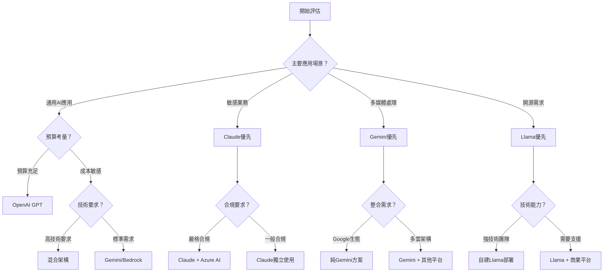

# 第9章：其他LLM平台比較與選擇策略

> **構建多元AI生態系統** - 全方位平台評估與智能選擇框架

## 📖 章節導覽

本章提供完整的LLM平台比較分析和選擇策略，幫助您構建最適合企業需求的多元化AI技術組合。

### 🎯 學習目標
完成本章學習後，您將能夠：
- 全面了解主要LLM平台的技術特性和商業定位
- 掌握多平台AI架構設計和整合策略
- 建立科學的平台選擇決策框架
- 實施有效的風險分散和成本優化策略

### 📊 內容結構

| 學習層次 | 目標讀者 | 閱讀時間 | 核心內容 |
|---------|---------|----------|----------|
| **🚀 平台概覽層** | 決策者、產品經理 | 10分鐘 | 平台對比、選擇原則 |
| **💼 策略規劃層** | 架構師、技術主管 | 20分鐘 | 整合架構、成本分析 |
| **🔬 實施專家層** | CTO、AI負責人 | 30分鐘+ | 部署策略、治理框架 |

---

## 🚀 第一層：LLM平台全景概覽（10分鐘掌握核心對比）

### 💎 主要平台戰略定位分析

**2025年LLM生態系統格局**

當今AI市場呈現多極化發展態勢，每個主要平台都有其獨特的技術優勢和戰略定位。企業需要基於自身需求和發展階段，選擇最適合的平台組合。

| 平台 | 核心優勢 | 戰略定位 | 最佳場景 | 企業適用度 |
|------|----------|----------|----------|------------|
| **OpenAI GPT** | 技術領先、生態完整 | AI產業標準制定者 | 通用AI應用、創新實驗 | ★★★★★ |
| **Claude** | 安全可信、憲章訓練 | 可信賴AI專家 | 敏感業務、專業服務 | ★★★★★ |
| **Google Gemini** | 多模態、生態整合 | 全方位AI平台 | 跨媒體應用、企業整合 | ★★★★☆ |
| **Meta Llama** | 開源自主、可定制 | 開放AI生態推動者 | 客製化需求、成本控制 | ★★★★☆ |
| **Microsoft Azure AI** | 企業整合、合規保障 | 企業AI解決方案領導者 | 大型企業、嚴格合規 | ★★★★★ |
| **Amazon Bedrock** | 雲端整合、模型選擇 | 雲原生AI服務提供商 | AWS生態、模型多樣化 | ★★★☆☆ |

### ⚡ 技術能力比較矩陣

**核心技術指標對比**

| 能力維度 | OpenAI | Claude | Gemini | Llama | Azure AI | Bedrock |
|---------|--------|--------|--------|-------|----------|---------|
| **文字理解** | ★★★★★ | ★★★★★ | ★★★★☆ | ★★★★☆ | ★★★★☆ | ★★★☆☆ |
| **邏輯推理** | ★★★★★ | ★★★★★ | ★★★★☆ | ★★★☆☆ | ★★★★☆ | ★★★☆☆ |
| **多模態處理** | ★★★★☆ | ★★★☆☆ | ★★★★★ | ★★☆☆☆ | ★★★☆☆ | ★★★☆☆ |
| **代碼生成** | ★★★★★ | ★★★★☆ | ★★★☆☆ | ★★★☆☆ | ★★★★☆ | ★★★☆☆ |
| **安全性** | ★★★★☆ | ★★★★★ | ★★★★☆ | ★★★☆☆ | ★★★★★ | ★★★★☆ |
| **可定制性** | ★★☆☆☆ | ★★☆☆☆ | ★★★☆☆ | ★★★★★ | ★★★☆☆ | ★★★★☆ |
| **成本效益** | ★★★☆☆ | ★★★☆☆ | ★★★★☆ | ★★★★★ | ★★★☆☆ | ★★★★☆ |

### 🎯 平台選擇決策樹

**基於業務需求的智能選擇框架**



**選擇原則優先級**

1. **業務需求匹配度**（權重：40%）
   - 核心應用場景適配性
   - 技術能力滿足程度
   - 未來擴展可能性

2. **風險管控能力**（權重：25%）
   - 數據安全保障
   - 合規性支援
   - 供應商可靠性

3. **成本效益考量**（權重：20%）
   - 初期投資成本
   - 運營維護成本
   - 長期ROI預期

4. **技術整合便利性**（權重：15%）
   - 現有系統整合難度
   - 團隊技術匹配度
   - 生態系統完整性

---

## 💼 第二層：多平台整合策略（20分鐘掌握架構設計）

### 🏗️ 混合AI架構設計

#### 智能平台編排系統

**多平台統一管理架構**

企業級AI應用往往需要結合多個平台的優勢，形成互補的技術組合。以下是一個典型的混合AI架構設計，可以最大化各平台的價值。

```python
class MultiPlatformAIOrchestrator:
    """
    多平台AI編排系統
    統一管理和調度不同AI平台的能力
    """
    
    def __init__(self, platform_configs):
        self.platforms = {
            'openai': OpenAIClient(platform_configs['openai']),
            'claude': ClaudeClient(platform_configs['claude']),
            'gemini': GeminiClient(platform_configs['gemini']),
            'llama': LlamaClient(platform_configs['llama'])
        }
        
        self.routing_engine = IntelligentRoutingEngine()
        self.cost_optimizer = CostOptimizationEngine()
        self.quality_monitor = QualityMonitoringSystem()
        self.failover_manager = FailoverManager()
    
    def process_ai_request(self, request):
        """
        智能處理AI請求，自動選擇最佳平台
        """
        # 請求分析和路由決策
        routing_decision = self.routing_engine.analyze_and_route(request)
        
        # 執行AI處理
        try:
            primary_result = self._execute_on_platform(
                routing_decision.primary_platform, 
                request
            )
            
            # 品質驗證
            quality_score = self.quality_monitor.evaluate_result(
                primary_result, request.quality_requirements
            )
            
            if quality_score >= request.min_quality_threshold:
                return self._format_response(primary_result, routing_decision)
            else:
                # 品質不達標，嘗試備用平台
                return self._execute_fallback_strategy(request, routing_decision)
                
        except Exception as e:
            # 主要平台失敗，觸發故障轉移
            return self.failover_manager.handle_platform_failure(
                request, routing_decision, e
            )
    
    def _execute_on_platform(self, platform_name, request):
        """
        在指定平台上執行AI任務
        """
        platform_client = self.platforms[platform_name]
        
        # 平台特化的請求適配
        adapted_request = self._adapt_request_for_platform(
            request, platform_name
        )
        
        # 執行請求
        result = platform_client.generate_response(adapted_request)
        
        # 記錄使用情況用於成本追蹤
        self.cost_optimizer.record_usage(
            platform_name, adapted_request, result
        )
        
        return result
    
    def _adapt_request_for_platform(self, request, platform_name):
        """
        為不同平台適配請求格式
        """
        adapters = {
            'openai': self._adapt_for_openai,
            'claude': self._adapt_for_claude,
            'gemini': self._adapt_for_gemini,
            'llama': self._adapt_for_llama
        }
        
        return adapters[platform_name](request)
    
    def _adapt_for_openai(self, request):
        """
        OpenAI平台請求適配
        """
        return {
            'messages': [
                {'role': 'system', 'content': request.system_prompt},
                {'role': 'user', 'content': request.user_input}
            ],
            'model': self._select_openai_model(request.complexity),
            'temperature': request.creativity_level,
            'max_tokens': request.max_response_length
        }
    
    def _adapt_for_claude(self, request):
        """
        Claude平台請求適配
        """
        # 利用Claude的XML結構化優勢
        structured_prompt = f"""
        <task>
        {request.user_input}
        </task>
        
        <requirements>
        {request.quality_requirements}
        </requirements>
        
        <thinking_level>
        {self._determine_claude_thinking_level(request.complexity)}
        </thinking_level>
        """
        
        return {
            'prompt': structured_prompt,
            'model': self._select_claude_model(request.complexity),
            'max_tokens': request.max_response_length
        }
    
    def _adapt_for_gemini(self, request):
        """
        Gemini平台請求適配
        """
        contents = [{'role': 'user', 'parts': [{'text': request.user_input}]}]
        
        # 如果有多模態內容，添加到請求中
        if hasattr(request, 'multimodal_content'):
            for content in request.multimodal_content:
                if content.type == 'image':
                    contents[0]['parts'].append({'inline_data': content.data})
                elif content.type == 'audio':
                    contents[0]['parts'].append({'inline_data': content.data})
        
        return {
            'contents': contents,
            'generation_config': {
                'temperature': request.creativity_level,
                'top_p': 0.8,
                'max_output_tokens': request.max_response_length
            }
        }

class IntelligentRoutingEngine:
    """
    智能路由引擎
    基於任務特性選擇最佳平台
    """
    
    def __init__(self):
        self.routing_rules = self._initialize_routing_rules()
        self.performance_history = PerformanceHistoryTracker()
        self.cost_analyzer = CostAnalyzer()
    
    def analyze_and_route(self, request):
        """
        分析請求並決定路由策略
        """
        # 請求特徵分析
        request_features = self._extract_request_features(request)
        
        # 平台適配性評分
        platform_scores = self._calculate_platform_scores(request_features)
        
        # 成本效益分析
        cost_analysis = self.cost_analyzer.analyze_platform_costs(
            request_features, platform_scores
        )
        
        # 選擇主要和備用平台
        primary_platform = self._select_primary_platform(
            platform_scores, cost_analysis, request.constraints
        )
        
        backup_platforms = self._select_backup_platforms(
            platform_scores, primary_platform
        )
        
        return RoutingDecision(
            primary_platform=primary_platform,
            backup_platforms=backup_platforms,
            confidence_score=platform_scores[primary_platform],
            cost_estimate=cost_analysis[primary_platform],
            routing_reason=self._generate_routing_explanation(
                primary_platform, request_features
            )
        )
    
    def _extract_request_features(self, request):
        """
        提取請求特徵用於路由決策
        """
        features = {
            'complexity_level': self._assess_complexity(request),
            'safety_requirements': self._assess_safety_needs(request),
            'multimodal_content': self._detect_multimodal_content(request),
            'domain_specificity': self._identify_domain(request),
            'response_time_requirement': request.urgency_level,
            'quality_threshold': request.min_quality_threshold,
            'cost_sensitivity': request.budget_constraints,
            'privacy_level': request.data_sensitivity
        }
        
        return features
    
    def _calculate_platform_scores(self, features):
        """
        計算各平台對當前請求的適配分數
        """
        scores = {}
        
        for platform_name in ['openai', 'claude', 'gemini', 'llama']:
            score = 0
            
            # 技術能力匹配度
            capability_score = self._assess_capability_match(
                platform_name, features
            )
            score += capability_score * 0.4
            
            # 成本效益
            cost_score = self._assess_cost_efficiency(
                platform_name, features
            )
            score += cost_score * 0.2
            
            # 安全性和合規性
            safety_score = self._assess_safety_compliance(
                platform_name, features
            )
            score += safety_score * 0.25
            
            # 歷史表現
            performance_score = self.performance_history.get_platform_score(
                platform_name, features
            )
            score += performance_score * 0.15
            
            scores[platform_name] = min(score, 1.0)  # 正規化到0-1範圍
        
        return scores
```

#### 成本最佳化策略

**多平台成本控制框架**

```python
class MultiPlatformCostOptimizer:
    """
    多平台成本最佳化管理器
    """
    
    def __init__(self):
        self.cost_tracker = RealTimeCostTracker()
        self.usage_analyzer = UsagePatternAnalyzer()
        self.budget_manager = BudgetManager()
        self.optimization_engine = OptimizationEngine()
    
    def optimize_platform_allocation(self, usage_history, budget_constraints):
        """
        最佳化平台使用分配
        """
        # 分析使用模式
        usage_patterns = self.usage_analyzer.analyze_patterns(usage_history)
        
        # 計算各平台成本效益
        cost_effectiveness = self._calculate_cost_effectiveness(usage_patterns)
        
        # 生成最佳化建議
        optimization_recommendations = {
            'workload_reallocation': self._recommend_workload_reallocation(
                usage_patterns, cost_effectiveness
            ),
            'platform_tier_adjustments': self._recommend_tier_adjustments(
                usage_patterns, budget_constraints
            ),
            'usage_schedule_optimization': self._optimize_usage_scheduling(
                usage_patterns, cost_effectiveness
            ),
            'contract_optimization': self._analyze_contract_opportunities(
                usage_patterns, budget_constraints
            )
        }
        
        # 預測實施效果
        projected_savings = self._project_cost_savings(
            optimization_recommendations, usage_patterns
        )
        
        return {
            'current_analysis': {
                'total_monthly_cost': usage_patterns['total_cost'],
                'platform_breakdown': usage_patterns['platform_costs'],
                'cost_trends': usage_patterns['trends']
            },
            'optimization_opportunities': optimization_recommendations,
            'projected_impact': projected_savings,
            'implementation_plan': self._create_implementation_plan(
                optimization_recommendations
            )
        }
    
    def _recommend_workload_reallocation(self, patterns, effectiveness):
        """
        推薦工作負載重新分配
        """
        recommendations = []
        
        # 識別可以轉移到更便宜平台的工作負載
        for task_type, usage_data in patterns['task_breakdown'].items():
            current_platform = usage_data['primary_platform']
            current_cost = usage_data['average_cost']
            
            # 尋找更具成本效益的替代平台
            alternatives = self._find_cost_effective_alternatives(
                task_type, current_platform, effectiveness
            )
            
            for alternative in alternatives:
                potential_savings = current_cost - alternative['cost']
                if potential_savings > 0:
                    recommendations.append({
                        'task_type': task_type,
                        'from_platform': current_platform,
                        'to_platform': alternative['platform'],
                        'monthly_volume': usage_data['monthly_requests'],
                        'cost_per_request_savings': potential_savings,
                        'monthly_savings': potential_savings * usage_data['monthly_requests'],
                        'quality_impact': alternative['quality_score'],
                        'implementation_complexity': alternative['complexity'],
                        'recommendation_confidence': alternative['confidence']
                    })
        
        # 按節省金額排序
        recommendations.sort(key=lambda x: x['monthly_savings'], reverse=True)
        
        return recommendations[:10]  # 返回前10個最有價值的建議
    
    def implement_cost_controls(self, budget_limits):
        """
        實施成本控制機制
        """
        cost_controls = {
            # 預算告警機制
            'budget_alerts': {
                'daily_budget_threshold': budget_limits['daily'] * 0.8,
                'monthly_budget_threshold': budget_limits['monthly'] * 0.8,
                'platform_specific_limits': {
                    platform: limit * 0.8 
                    for platform, limit in budget_limits['platform_limits'].items()
                }
            },
            
            # 自動限流機制
            'automatic_throttling': {
                'enable_when_budget_exceeded': True,
                'throttling_priority': [
                    'low_priority_tasks',
                    'experimental_requests', 
                    'non_critical_batch_jobs'
                ],
                'emergency_shutdown_threshold': budget_limits['monthly'] * 1.1
            },
            
            # 智能降級策略
            'intelligent_downgrading': {
                'enable_model_downgrading': True,
                'quality_threshold_for_downgrade': 0.8,
                'cost_savings_target': 0.3,
                'automatic_approval_limit': budget_limits['daily'] * 0.1
            }
        }
        
        # 實施控制機制
        for control_type, config in cost_controls.items():
            self._implement_cost_control(control_type, config)
        
        return cost_controls
```

### 📊 風險分散策略

#### 多重備援架構設計

**避免單點依賴的系統設計**

```python
class RiskDiversificationManager:
    """
    風險分散管理器
    實施多重備援和故障轉移策略
    """
    
    def __init__(self, platforms_config):
        self.platforms = platforms_config
        self.health_monitor = PlatformHealthMonitor()
        self.failover_orchestrator = FailoverOrchestrator()
        self.risk_assessor = RiskAssessment()
    
    def design_resilient_architecture(self, business_requirements):
        """
        設計具有韌性的多平台架構
        """
        resilience_strategy = {
            # 平台分散策略
            'platform_diversification': {
                'primary_platforms': self._select_primary_platforms(
                    business_requirements
                ),
                'backup_platforms': self._select_backup_platforms(
                    business_requirements
                ),
                'workload_distribution': self._design_workload_distribution(
                    business_requirements
                )
            },
            
            # 故障轉移機制
            'failover_mechanisms': {
                'automatic_failover': {
                    'enabled': True,
                    'trigger_conditions': [
                        'response_time_threshold_exceeded',
                        'error_rate_spike',
                        'platform_unavailability'
                    ],
                    'failover_sequence': self._define_failover_sequence(),
                    'rollback_conditions': [
                        'primary_platform_recovery',
                        'backup_platform_performance_degradation'
                    ]
                },
                'graceful_degradation': {
                    'enabled': True,
                    'degradation_levels': [
                        'reduced_feature_set',
                        'simplified_responses',
                        'cached_responses_only'
                    ],
                    'quality_thresholds': [0.9, 0.7, 0.5]
                }
            },
            
            # 數據同步和一致性
            'data_consistency': {
                'session_state_management': 'distributed_caching',
                'user_context_synchronization': 'real_time_replication',
                'configuration_consistency': 'version_controlled_deployment'
            }
        }
        
        return self._implement_resilience_strategy(resilience_strategy)
    
    def monitor_platform_risks(self):
        """
        監控各平台風險狀況
        """
        risk_dashboard = {}
        
        for platform_name in self.platforms.keys():
            platform_risks = {
                'availability_risk': self._assess_availability_risk(platform_name),
                'performance_risk': self._assess_performance_risk(platform_name),
                'cost_volatility_risk': self._assess_cost_risk(platform_name),
                'compliance_risk': self._assess_compliance_risk(platform_name),
                'vendor_lock_in_risk': self._assess_vendor_risk(platform_name),
                'data_security_risk': self._assess_security_risk(platform_name)
            }
            
            # 計算綜合風險分數
            overall_risk = self._calculate_overall_risk(platform_risks)
            
            risk_dashboard[platform_name] = {
                'individual_risks': platform_risks,
                'overall_risk_score': overall_risk,
                'risk_level': self._classify_risk_level(overall_risk),
                'mitigation_recommendations': self._generate_risk_mitigation_recommendations(
                    platform_risks
                )
            }
        
        # 組合風險分析
        portfolio_risk = self._analyze_portfolio_risk(risk_dashboard)
        
        return {
            'platform_risks': risk_dashboard,
            'portfolio_risk': portfolio_risk,
            'risk_mitigation_actions': self._prioritize_mitigation_actions(
                risk_dashboard, portfolio_risk
            )
        }
    
    def _assess_availability_risk(self, platform_name):
        """
        評估平台可用性風險
        """
        historical_uptime = self.health_monitor.get_uptime_history(
            platform_name, days=90
        )
        
        # 計算可用性指標
        availability_metrics = {
            'average_uptime': historical_uptime['average'],
            'worst_downtime_duration': historical_uptime['max_downtime'],
            'downtime_frequency': historical_uptime['incident_count'],
            'trend': historical_uptime['trend_analysis']
        }
        
        # 風險評分
        risk_score = self._calculate_availability_risk_score(availability_metrics)
        
        return {
            'metrics': availability_metrics,
            'risk_score': risk_score,
            'risk_factors': self._identify_availability_risk_factors(availability_metrics)
        }
    
    def implement_circuit_breaker_pattern(self):
        """
        實施熔斷器模式
        """
        circuit_breakers = {}
        
        for platform_name in self.platforms.keys():
            circuit_breakers[platform_name] = CircuitBreaker(
                failure_threshold=5,  # 連續失敗5次觸發熔斷
                timeout_duration=60,  # 熔斷60秒
                expected_exception=PlatformException,
                recovery_timeout=30,  # 嘗試恢復間隔30秒
                name=f"{platform_name}_circuit_breaker"
            )
        
        return circuit_breakers
```

---

## 🔬 第三層：企業級實施與治理（30分鐘精通部署框架）

### 🏢 多平台治理框架

#### 統一AI治理體系

**跨平台治理架構設計**

```yaml
# 多平台AI治理框架
multi_platform_governance:
  governance_structure:
    central_ai_committee:
      leadership:
        - chief_ai_officer: "AI戰略和治理總負責人"
        - technology_lead: "多平台技術架構負責人"
        - risk_manager: "AI風險管控專家"
        - compliance_officer: "法規合規專員"
        - business_representatives: "各業務單位代表"
      
      responsibilities:
        - platform_selection_approval: "平台選擇和變更審批"
        - governance_policy_development: "治理政策制定和更新"
        - risk_tolerance_setting: "風險容忍度設定"
        - budget_allocation_oversight: "預算分配監督"
        - performance_review: "治理效果定期檢討"
    
    platform_specific_teams:
      openai_team:
        focus: "OpenAI平台專精應用和最佳化"
        expertise: ["GPT模型調優", "Function Calling整合", "成本控制"]
        
      claude_team:
        focus: "Claude憲章訓練和安全應用"
        expertise: ["XML結構設計", "思考預算管理", "安全合規"]
        
      gemini_team:
        focus: "多模態應用和Google生態整合"
        expertise: ["跨媒體分析", "Workspace整合", "雲端部署"]
        
      open_source_team:
        focus: "開源模型部署和客製化"
        expertise: ["Llama部署", "模型微調", "基礎設施管理"]

  unified_policies:
    data_governance:
      data_classification:
        - public_data: "公開數據，無特殊限制"
        - internal_data: "內部數據，需基本保護"
        - confidential_data: "機密數據，限制平台使用"
        - restricted_data: "受限數據，僅允許特定平台"
      
      data_residency_requirements:
        - geographic_restrictions: "數據地理位置限制"
        - sovereignty_compliance: "數據主權合規要求"
        - cross_border_transfer_rules: "跨境傳輸規則"
      
      retention_policies:
        - log_retention: "日誌保存期限和清理規則"
        - user_data_retention: "用戶數據保存政策"
        - model_training_data: "訓練數據使用和保存"
    
    security_standards:
      authentication_requirements:
        - multi_factor_authentication: "多因素身份驗證"
        - single_sign_on_integration: "統一登入整合"
        - service_account_management: "服務帳戶管理"
      
      encryption_standards:
        - data_in_transit: "傳輸過程加密標準"
        - data_at_rest: "存儲數據加密要求"
        - key_management: "密鑰管理最佳實踐"
      
      access_control:
        - role_based_access: "角色權限管理"
        - principle_of_least_privilege: "最小權限原則"
        - regular_access_review: "定期權限審查"
    
    quality_assurance:
      output_quality_standards:
        - accuracy_thresholds: "準確性最低標準"
        - consistency_requirements: "一致性要求"
        - bias_detection_protocols: "偏見檢測程序"
      
      monitoring_requirements:
        - real_time_quality_monitoring: "即時品質監控"
        - periodic_quality_audits: "定期品質稽核"
        - user_feedback_integration: "用戶回饋整合"
      
      continuous_improvement:
        - performance_benchmarking: "效能基準測試"
        - best_practice_sharing: "最佳實踐分享"
        - innovation_experimentation: "創新實驗管理"

  cross_platform_orchestration:
    unified_api_gateway:
      request_routing:
        - intelligent_platform_selection: "智能平台選擇"
        - load_balancing: "負載均衡管理"
        - failover_handling: "故障轉移處理"
      
      security_enforcement:
        - unified_authentication: "統一身份驗證"
        - rate_limiting: "流量限制控制"
        - request_validation: "請求內容驗證"
      
      monitoring_integration:
        - unified_logging: "統一日誌收集"
        - metrics_aggregation: "指標聚合分析"
        - alert_correlation: "告警關聯分析"
    
    workflow_orchestration:
      multi_platform_workflows:
        - sequential_processing: "順序處理工作流"
        - parallel_processing: "並行處理工作流"
        - conditional_routing: "條件式路由工作流"
      
      state_management:
        - session_persistence: "會話狀態持續"
        - context_sharing: "上下文資訊共享"
        - transaction_consistency: "事務一致性保證"
    
    cost_management:
      unified_billing:
        - cost_center_allocation: "成本中心分配"
        - usage_based_charging: "使用量計費"
        - budget_tracking: "預算追蹤管理"
      
      optimization_automation:
        - automatic_cost_optimization: "自動成本最佳化"
        - usage_pattern_analysis: "使用模式分析"
        - predictive_budgeting: "預測性預算規劃"

# 實施階段規劃
implementation_phases:
  phase_1_foundation:
    duration: "3個月"
    objectives:
      - "建立基礎治理架構"
      - "實施核心安全控制"
      - "設置基本監控系統"
    
    deliverables:
      - governance_charter: "治理章程文件"
      - security_baseline: "安全基線配置"
      - monitoring_dashboard: "基礎監控儀表板"
    
    success_criteria:
      - "治理委員會成立並運作"
      - "所有平台通過安全基線檢查"
      - "基本監控指標正常運行"
  
  phase_2_integration:
    duration: "4個月"
    objectives:
      - "實施跨平台整合"
      - "建立統一API閘道"
      - "部署工作流編排系統"
    
    deliverables:
      - unified_api_gateway: "統一API閘道"
      - workflow_orchestrator: "工作流編排器"
      - cost_management_system: "成本管理系統"
    
    success_criteria:
      - "統一API閘道處理80%請求"
      - "跨平台工作流正常運行"
      - "成本追蹤精確度>95%"
  
  phase_3_optimization:
    duration: "持續進行"
    objectives:
      - "持續效能最佳化"
      - "完善治理流程"
      - "推動創新應用"
    
    activities:
      - performance_tuning: "效能調優"
      - process_improvement: "流程改進"
      - innovation_projects: "創新專案"
```

### 📊 效能評估與最佳化

#### 多平台效能管理系統

```python
class MultiPlatformPerformanceManager:
    """
    多平台效能管理和最佳化系統
    """
    
    def __init__(self, platforms_config):
        self.platforms_config = platforms_config
        self.metrics_collector = UnifiedMetricsCollector()
        self.performance_analyzer = PerformanceAnalyzer()
        self.optimization_engine = OptimizationEngine()
        self.benchmarking_suite = BenchmarkingSuite()
    
    def establish_performance_baseline(self):
        """
        建立多平台效能基線
        """
        baseline_tests = {
            # 標準化測試場景
            'standard_qa': {
                'description': '標準問答任務',
                'test_cases': self._generate_qa_test_cases(),
                'metrics': ['response_time', 'accuracy', 'cost_per_query']
            },
            'complex_reasoning': {
                'description': '複雜推理任務',
                'test_cases': self._generate_reasoning_test_cases(),
                'metrics': ['response_time', 'reasoning_quality', 'cost_per_query']
            },
            'multimodal_analysis': {
                'description': '多模態分析任務',
                'test_cases': self._generate_multimodal_test_cases(),
                'metrics': ['response_time', 'analysis_accuracy', 'cost_per_query']
            },
            'batch_processing': {
                'description': '批量處理任務',
                'test_cases': self._generate_batch_test_cases(),
                'metrics': ['throughput', 'error_rate', 'cost_efficiency']
            }
        }
        
        baseline_results = {}
        
        for test_category, test_config in baseline_tests.items():
            category_results = {}
            
            for platform_name in self.platforms_config.keys():
                platform_results = self._run_platform_benchmark(
                    platform_name, test_config
                )
                category_results[platform_name] = platform_results
            
            baseline_results[test_category] = category_results
        
        # 分析和比較結果
        comparative_analysis = self._analyze_platform_performance(baseline_results)
        
        # 生成效能基線報告
        baseline_report = self._generate_baseline_report(
            baseline_results, comparative_analysis
        )
        
        return {
            'raw_results': baseline_results,
            'comparative_analysis': comparative_analysis,
            'baseline_report': baseline_report,
            'optimization_recommendations': self._generate_optimization_recommendations(
                comparative_analysis
            )
        }
    
    def _run_platform_benchmark(self, platform_name, test_config):
        """
        在特定平台上運行基準測試
        """
        platform_client = self._get_platform_client(platform_name)
        test_results = []
        
        for test_case in test_config['test_cases']:
            # 執行測試
            start_time = time.time()
            
            try:
                response = platform_client.process_request(test_case['input'])
                end_time = time.time()
                
                # 計算指標
                metrics = {
                    'response_time': end_time - start_time,
                    'success': True,
                    'response_length': len(response.get('text', '')),
                    'cost_estimate': self._estimate_request_cost(
                        platform_name, test_case, response
                    )
                }
                
                # 品質評估
                if 'expected_output' in test_case:
                    quality_score = self._evaluate_response_quality(
                        response, test_case['expected_output']
                    )
                    metrics['quality_score'] = quality_score
                
            except Exception as e:
                end_time = time.time()
                metrics = {
                    'response_time': end_time - start_time,
                    'success': False,
                    'error': str(e),
                    'cost_estimate': 0,
                    'quality_score': 0
                }
            
            test_results.append(metrics)
        
        # 聚合測試結果
        aggregated_results = self._aggregate_test_results(test_results)
        
        return aggregated_results
    
    def monitor_real_time_performance(self):
        """
        即時效能監控
        """
        monitoring_dashboard = {
            'current_status': {},
            'performance_trends': {},
            'alerts': [],
            'optimization_opportunities': []
        }
        
        for platform_name in self.platforms_config.keys():
            # 收集即時指標
            current_metrics = self.metrics_collector.get_current_metrics(platform_name)
            
            # 效能狀態評估
            status_assessment = self._assess_platform_status(current_metrics)
            monitoring_dashboard['current_status'][platform_name] = status_assessment
            
            # 趨勢分析
            trend_analysis = self.performance_analyzer.analyze_trends(
                platform_name, time_window='24h'
            )
            monitoring_dashboard['performance_trends'][platform_name] = trend_analysis
            
            # 檢查告警條件
            alerts = self._check_alert_conditions(platform_name, current_metrics)
            monitoring_dashboard['alerts'].extend(alerts)
            
            # 識別最佳化機會
            opportunities = self.optimization_engine.identify_opportunities(
                platform_name, current_metrics, trend_analysis
            )
            monitoring_dashboard['optimization_opportunities'].extend(opportunities)
        
        return monitoring_dashboard
    
    def optimize_platform_allocation(self):
        """
        最佳化平台工作負載分配
        """
        # 收集歷史效能數據
        historical_data = self.metrics_collector.get_historical_data(
            time_range='30d'
        )
        
        # 分析工作負載模式
        workload_patterns = self.performance_analyzer.analyze_workload_patterns(
            historical_data
        )
        
        # 生成最佳化建議
        optimization_recommendations = {
            'workload_reallocation': [],
            'capacity_adjustments': [],
            'routing_rule_updates': [],
            'cost_optimization_opportunities': []
        }
        
        # 工作負載重新分配建議
        for workload_type, pattern_data in workload_patterns.items():
            current_allocation = pattern_data['current_platform_distribution']
            optimal_allocation = self._calculate_optimal_allocation(
                workload_type, pattern_data
            )
            
            if self._significant_improvement_possible(current_allocation, optimal_allocation):
                optimization_recommendations['workload_reallocation'].append({
                    'workload_type': workload_type,
                    'current_allocation': current_allocation,
                    'recommended_allocation': optimal_allocation,
                    'expected_benefits': self._calculate_reallocation_benefits(
                        current_allocation, optimal_allocation, pattern_data
                    )
                })
        
        # 容量調整建議
        for platform_name in self.platforms_config.keys():
            capacity_analysis = self._analyze_platform_capacity(
                platform_name, historical_data
            )
            
            if capacity_analysis['adjustment_needed']:
                optimization_recommendations['capacity_adjustments'].append({
                    'platform': platform_name,
                    'current_capacity': capacity_analysis['current'],
                    'recommended_capacity': capacity_analysis['recommended'],
                    'justification': capacity_analysis['reasoning']
                })
        
        return optimization_recommendations
    
    def generate_performance_report(self, time_period='monthly'):
        """
        生成多平台效能報告
        """
        report_data = {
            'executive_summary': self._create_executive_summary(time_period),
            'platform_performance_comparison': self._create_platform_comparison(time_period),
            'cost_analysis': self._create_cost_analysis(time_period),
            'quality_trends': self._analyze_quality_trends(time_period),
            'optimization_impact': self._assess_optimization_impact(time_period),
            'recommendations': self._generate_strategic_recommendations(time_period)
        }
        
        return self._format_performance_report(report_data)
```

### 🎯 戰略規劃與未來發展

#### 長期AI平台策略

```python
class AIStrategyPlanner:
    """
    AI平台長期戰略規劃器
    """
    
    def __init__(self):
        self.market_analyzer = MarketTrendAnalyzer()
        self.technology_forecaster = TechnologyForecaster()
        self.business_value_assessor = BusinessValueAssessor()
        self.risk_analyzer = StrategicRiskAnalyzer()
    
    def develop_five_year_strategy(self, organization_context):
        """
        制定五年AI平台戰略
        """
        strategic_analysis = {
            # 市場趨勢分析
            'market_trends': self.market_analyzer.analyze_ai_market_trends(),
            
            # 技術發展預測
            'technology_forecast': self.technology_forecaster.forecast_ai_evolution(
                time_horizon='5_years'
            ),
            
            # 組織需求演變
            'organizational_evolution': self._analyze_organizational_evolution(
                organization_context
            ),
            
            # 競爭環境變化
            'competitive_landscape': self._analyze_competitive_dynamics()
        }
        
        # 制定戰略選項
        strategic_options = self._generate_strategic_options(strategic_analysis)
        
        # 評估戰略選項
        option_evaluation = self._evaluate_strategic_options(
            strategic_options, organization_context
        )
        
        # 制定實施路線圖
        implementation_roadmap = self._create_implementation_roadmap(
            option_evaluation['recommended_strategy']
        )
        
        return {
            'strategic_analysis': strategic_analysis,
            'strategic_options': strategic_options,
            'recommended_strategy': option_evaluation['recommended_strategy'],
            'implementation_roadmap': implementation_roadmap,
            'success_metrics': self._define_success_metrics(
                option_evaluation['recommended_strategy']
            ),
            'risk_mitigation_plan': self._create_risk_mitigation_plan(
                option_evaluation['identified_risks']
            )
        }
    
    def _generate_strategic_options(self, analysis):
        """
        生成戰略選項
        """
        strategic_options = {
            'conservative_approach': {
                'description': '保守穩健的多平台策略',
                'characteristics': [
                    '主要依靠成熟平台（OpenAI、Claude）',
                    '漸進式採用新技術',
                    '重點關注風險管控和穩定性'
                ],
                'timeline': '24個月全面實施',
                'investment_level': '中等',
                'risk_level': '低'
            },
            
            'aggressive_innovation': {
                'description': '激進創新的前沿技術策略',
                'characteristics': [
                    '積極採用新興平台和技術',
                    '大量投資開源和客製化解決方案',
                    '追求技術領先和差異化優勢'
                ],
                'timeline': '36個月分階段實施',
                'investment_level': '高',
                'risk_level': '高'
            },
            
            'balanced_diversification': {
                'description': '平衡多元化的混合策略',
                'characteristics': [
                    '商業平台與開源解決方案並重',
                    '基於業務需求靈活選擇平台',
                    '建立完整的平台生態系統'
                ],
                'timeline': '30個月全面部署',
                'investment_level': '中高',
                'risk_level': '中等'
            },
            
            'cost_optimization_focus': {
                'description': '成本導向的效率最大化策略',
                'characteristics': [
                    '優先選擇成本效益最高的解決方案',
                    '大量使用開源和自建解決方案',
                    '通過規模化實現成本優勢'
                ],
                'timeline': '18個月基礎實施',
                'investment_level': '低中',
                'risk_level': '中等'
            }
        }
        
        return strategic_options
    
    def monitor_strategy_execution(self, strategy, current_progress):
        """
        監控戰略執行進度
        """
        execution_assessment = {
            'progress_tracking': self._assess_implementation_progress(
                strategy, current_progress
            ),
            'milestone_achievement': self._evaluate_milestone_achievement(
                strategy['implementation_roadmap'], current_progress
            ),
            'kpi_performance': self._analyze_kpi_performance(
                strategy['success_metrics'], current_progress
            ),
            'risk_materialization': self._assess_risk_materialization(
                strategy['risk_mitigation_plan'], current_progress
            )
        }
        
        # 識別需要調整的領域
        adjustment_needs = self._identify_strategy_adjustments(execution_assessment)
        
        # 生成戰略更新建議
        strategy_updates = self._recommend_strategy_updates(
            strategy, execution_assessment, adjustment_needs
        )
        
        return {
            'execution_assessment': execution_assessment,
            'adjustment_recommendations': adjustment_needs,
            'strategy_updates': strategy_updates,
            'next_review_priorities': self._prioritize_next_review_areas(
                execution_assessment
            )
        }
```

---

## 💡 章節核心要點總結

### 🎯 多平台策略核心價值
1. **風險分散**：避免單一平台依賴，建立韌性系統架構
2. **成本最佳化**：通過智能選擇和負載均衡實現成本效益最大化
3. **能力互補**：結合各平台優勢，構建最強AI能力組合
4. **未來適應性**：靈活應對技術變化和市場發展

### 🛠️ 關鍵實施策略
1. **智能路由系統**：基於任務特性和成本考量的動態平台選擇
2. **統一治理框架**：跨平台的一致性政策和管理機制
3. **效能監控體系**：全面的多平台效能追蹤和最佳化
4. **風險管控機制**：多重備援和故障轉移的韌性設計

### 🚀 企業競爭優勢
1. **技術靈活性**：快速適應新技術和市場變化的能力
2. **成本控制力**：精準的成本管理和最佳化能力
3. **創新加速度**：利用不同平台特色加速創新應用
4. **風險管控力**：全面的風險識別和緩解機制

### 🔮 未來發展方向
1. **智能編排升級**：更智能的平台選擇和工作負載分配
2. **生態系統深化**：與更多AI平台和服務的深度整合
3. **自適應優化**：基於機器學習的自動化最佳化系統
4. **價值創新**：通過平台組合創造新的商業價值模式

---

<p align="center">
<strong>🚀 掌握多平台AI策略，構建未來競爭優勢！</strong><br>
<em>從平台比較到戰略實施的完整企業級指南</em>
</p>

<p align="center">
<a href="第8章：Google AI與多模態技術應用.md">

</a>
<a href="第10章：進階技術與創新應用.md">

</a>
<a href="README.md">

</a>
</p>